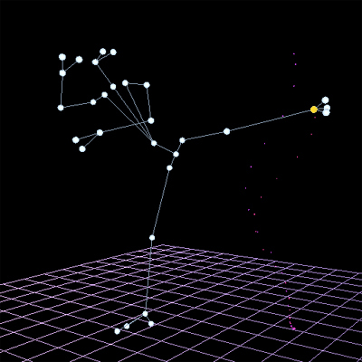
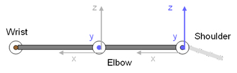
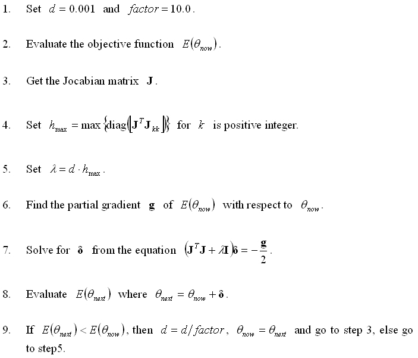
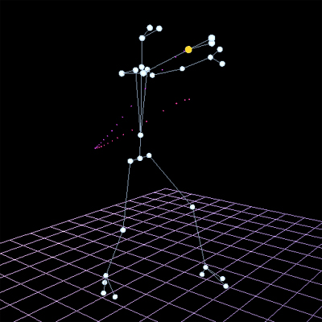
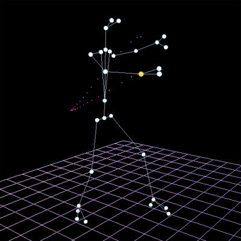
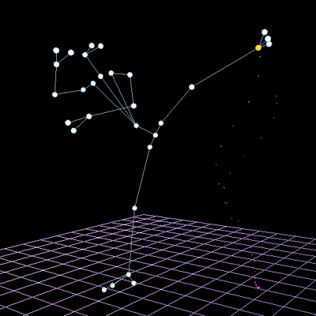

# MoCap Motion Optimization

 In this project, the optimizations to both punching and kicking motions from the MoCap system are implemented.  For a punching motion, the focusing joints are elbow and wrist joints.  Similarly, for a kicking motion, they are knee joint and ankle joint.  Wrist and ankle joints are the effecters.  Here, I optimized these focusing joints of the original MoCap Kungfu motion (punching or kicking), by constraining the the locus of the effecter to a new one, to generate a new attacking motion.

<p align="center">
  <br>
</p>

Literally, it is a 2-joint problem, each with at most 6 degrees of freedom (DOFs).  In the implementation, the joint representation is in BVH format, so each of them then has only 3 DOFs (6 DOFs for root joint, because of including translational components), with Euler angle ordering ZXY.  In addition, for the elbow or knee joint of human, there is only one DOF contributing to the attacking motion significantly.  For the shoulder or hip joint, there are two DOFs which are crucial for Kungfu motion's visualization.  Therefore, I restricted them during the optimization, so that the result will adhere this roughly bio-mechanical assumption and will be more natural.  Figure 1 shows the top view of DOFs being considered in the optimization.

*Figure 1: Activated DOFs are shown in blue and restricted DOFs are shown in grey.*

<p align="center">
  <br>
</p>

Here is the main loop of the Gauss-Newton based Levenbery-Marquardt algorithm:

<p align="center">
  <br>
</p>

In our case, the objective function simply is E = powf((EffecterPos - Goal).Mag(), 2.0f).  That's to minimize the distance between the current effecter's position and a certain desired point of the new locus, by substituting a suitable tuple / solution to EffecterPos (function of a tuple).  The tuple consists of 6 floats, 3 for shoulder's / hip's rotational components and 3 for elbow's / knee's rotational components.  As the above-mentioned, 3 DOFs are froze and 3 DOFs are activated during the optimization, so the Jocabian matrix will be of dimension 3x3.  Below is the code fragment for getting the 3x3 Jocabian matrix:

```cpp
bool GetJocabian3x3(MotionData *pMD, unsigned int nFrame, Tuple *pTnow, Tuple *pTprev, Matrix *pJMat)
{
	if(pMD == NULL || pTnow == NULL || pTprev == NULL || pJMat == NULL)
		return false;

	float dx, dy, dz, db1, dg1, db2;

	Vector3D EffecterPosNow, EffecterPosPrev;

	Tuple Ttemp;

	　

	//Get previous effecter's position.

	GetEffectorPosition(pMD, nFrame, pTprev, &EffecterPosPrev);

	//Get change in tuple.

	db1 = pTnow->beta1 - pTprev->beta1;

	dg1 = pTnow->gamma1 - pTprev->gamma1;

	db2 = pTnow->beta2 - pTprev->beta2;

	if((float)fabs(db1) < threshold)
		db1 = threshold;

	if((float)fabs(dg1) < threshold)
		dg1 = threshold;

	if((float)fabs(db2) < threshold)
		db2 = threshold;

	/////////////////////////////////////////////////////////////////////////////////////

	//First column

	Ttemp = *pTprev;

	Ttemp.beta1 += db1;

	GetEffectorPosition(pMD, nFrame, &Ttemp, &EffecterPosNow);

	dx = EffecterPosNow.x - EffecterPosPrev.x;

	dy = EffecterPosNow.y - EffecterPosPrev.y;

	dz = EffecterPosNow.z - EffecterPosPrev.z;

	pJMat->m[0] = dx / db1;

	pJMat->m[3] = dy / db1;

	pJMat->m[6] = dz / db1;

	/////////////////////////////////////////////////////////////////////////////////////

	//Second column

	Ttemp = *pTprev;

	Ttemp.gamma1 += dg1;

	GetEffectorPosition(pMD, nFrame, &Ttemp, &EffecterPosNow);

	dx = EffecterPosNow.x - EffecterPosPrev.x;

	dy = EffecterPosNow.y - EffecterPosPrev.y;

	dz = EffecterPosNow.z - EffecterPosPrev.z;

	pJMat->m[1] = dx / dg1;

	pJMat->m[4] = dy / dg1;

	pJMat->m[7] = dz / dg1;

	/////////////////////////////////////////////////////////////////////////////////////

	//Third column

	Ttemp = *pTprev;

	Ttemp.beta2 += db2;

	GetEffectorPosition(pMD, nFrame, &Ttemp, &EffecterPosNow);

	dx = EffecterPosNow.x - EffecterPosPrev.x;

	dy = EffecterPosNow.y - EffecterPosPrev.y;

	dz = EffecterPosNow.z - EffecterPosPrev.z;

	pJMat->m[2] = dx / db2;

	pJMat->m[5] = dy / db2;

	pJMat->m[8] = dz / db2;

	/////////////////////////////////////////////////////////////////////////////////////

	return true;

}
```

In addition, the approach to calculate the new locus is that, the source locus of the effecter from MoCap data is stored in format of cylinder coordinate, with cylinder axis formed by two end points of the source locus.  When the hitting point is changed (change in the point in the last frame of an attacking motion), there will be a new cylinder axis to define a new cylinder, and then source locus points stored in the existing cylinder will be mapped to that new cylinder to form a new locus for the optimization.  The utility for the extraction is already included in the executable.

<p align="center">
  
  
  <br>
  The last frame of a source punching motion is shown on the left.  The right one shows the optimized punching motion with a lower effecter position.
</p>

<p align="center">
  
  
  <br>
  The left one illustrates the last frame of a source kicking motion and the right one shows the optimized kicking motion with a lower hitting point. A yellow marker represents an effecter.
</p>
